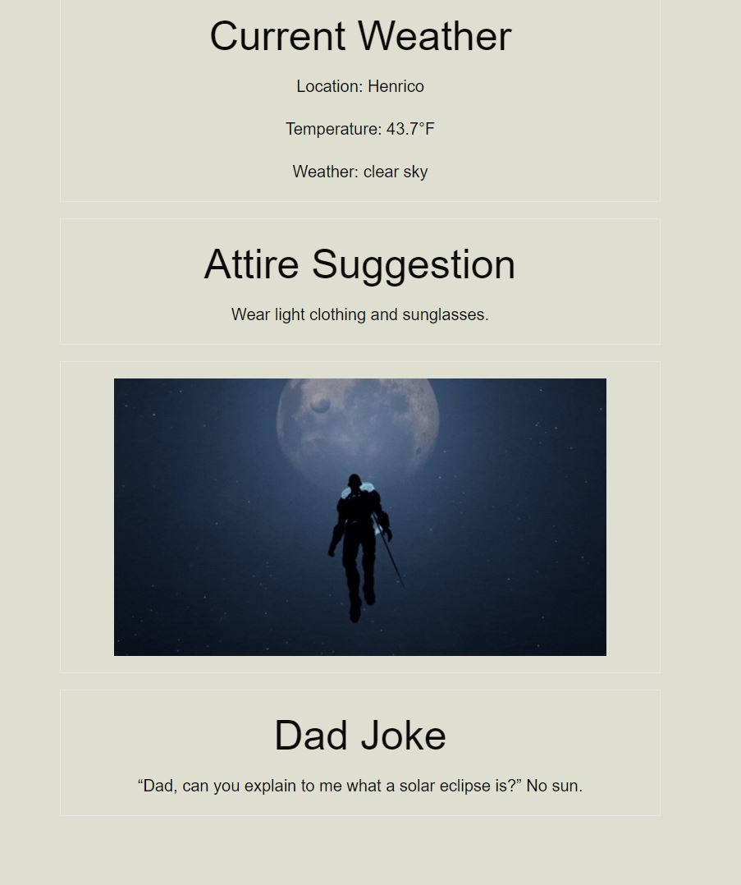

# Jokes and Jackets

This app notifies the user the weather based on their location what attire is necessary for the day, based on the current weather called by OpenWeather API. In addition, GIPHY’s are used to showcase a visual of the current weather from an array used within the API library based on size and search name. Along with these, we decided to add a dad joke (3rd API implemented), just for fun and an “lol”.

## Getting Started:
1. Clone the repository from https://github.com/mojo718/JokesAndJackets
2. Open script.js in your favorite code editor to review the Javascript

Live site:
https://mojo718.github.io/JokesAndJackets

Screenshots Below:

